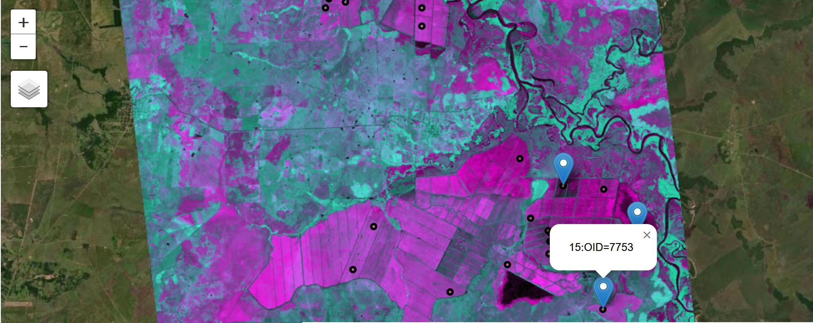

# LUCinSA_helpers
Helper functions and notebooks to interact with data on High-Performance Computing environment, designed to be used in conjunction with processing guide for remote sensing projects on Land-Use Change in Latin America: https://klwalker-sb.github.io/LUCinLA_stac/ 

## Uses

### To summarize processing status, uncover errors and conduct quality control amidst a large numbers of files in HPC environment
#####      single cell error checking / quality control:
* [check download logs ](#check-download-logs)(`check_dl_logs`)
* [check processing status for cell ](#check-processing-status-for-cell)(`get_cell_status`)
* [identify external image errors ](#identify-external-image-errors)(`processing.info` with notebook `1a_ExploreData_FileContent.ipynb`)
* [identify internal image errors ](#identify-internal-image-errors)(`check_valid_pix`, `check_ts_windows` with notebook `1t_Final_Processing_Checks`)
* [view effects of coregistration ](#view-coregistration-effects)(Notebook `1p_ExploreProcessing_coregistration.ipynb`)
* [interactively select images to include/exclude from thumbnails ](#make-thumbails-for-quality-control)(Notebook `2b_ViewTimeSeriesComposite.ipynb`)

#####      multi-cell summarization and error checking
* [summarize images processed ](#summarize-images-processed-for-all-cells)(`summarize_images_multicell`)
* [get processing summary ](#get-processing-summary)(`update_summary_db` and notebook `5a_SummarizeData_ImagesProcessed.ipynb`)
* [mosaic rasters ](#mosaic-rasters-from-multiple-cells)(`moaic`)

### To quickly visualize inputs and outputs of time-series analysis for quality control and interactive troubleshooting
* [get_time_series_at_point ](#get-time-series-at-point)(`get_time_series` and notebook `2b.TimeSeriesSignatures.ipynb`)
* [make_ts_composite raster ](#make-ts-composite-raster)(`make_ts_composite` with optional bash script `make_ts_composite.sh`)
* [interactively select points and view time-series data on cluster ](#interactive-time-series-feedback)
 
### To set and document parameter choices and compare outputs for model optimization
* [compare single-year rf models](#compare-rf-models)(Notebook `6b_RandomForest_ModelComparisons.ipynb`)

### Also (temporarily) hosts functions to:

###        create modelling features from smoothed time-series indices and segmentation outputs 
* [make raster variable stack ](#make-raster-variable-stack)(`make_variable_stack` with bash script `rf0_raster_var_stack.sh`)
* [make variable dataframe for sample points ](#make-variable-dataframe-for-sample-points)(`make_var_dataframe` with bash script `rf1_var_data_frame.sh`
###        create single-year random forest classification model
* [build random forest model ](#bulid-rf-model)(`rf_model`) 
###        apply random forest model to gridded data to create wall-to-wall map
* [classify_cell ](#apply-rf-model-to-classify-cell)(`rf_classification`)

## to install:
with your LUCinLA pipeline environment activated (see [this page of the LUCinLA_stac guide](https://klwalker-sb.github.io/LUCinLA_sta/Pipeline.html))
clone this repo into your homespace on the HPC cluster and install it: 
```
git clone https://github.com/klwalker-sb/LUCinSA_helpers
cd LUCinSA_helpers
python setup.py build && pip install .
```
Jupyter notebook tools also need to be installed into your environment if not already:
```
conda install -c conda-forge notebook ipykernel jupyter_contrib_nbextensions
```
To be able to run interactive notebook features (e.g. click on point to get time series, print thumbnails), additional modules are needed:
```
conda install -c conda-forge ipywidgets ipyleaflet localtileserver
conda install -c anaconda pillow
```

## to use:
Installed processes that can be run from command line / SLURM:
                        
Example SLURM scripts are included for these processes in the BashScripts folder.
get_time_series, rf_classification, and mosaic use significant resources and should be run through SLURM for accounting (when running 
processes through jupyter notebook, the resources are not accounted for and might result in crashing the whole HPC cluster if resources are
already maxed out and more are demanded)

Many small processes can be run through the Jupyter notebooks in the notebooks folder.
To access a Jupyter notebook via the cluster see [this page of the LUCinLA_STAC guide](https://klwalker-sb.github.io/LUCinLA_stac/)
Before running Jupyter notebooks, set the parameters in `notebook_params.ipynb` and run all cells of that notebook.
By doing so, you should not need to alter the text in any of the notebooks themselves (unless adding/modifying methods).

To save a notebook with displayed outputs, run the last cell of the notebook:
`To save an html copy of this notebook with all outputs`. This will save an html copy in the `notebooks/Outputs` folder. 
Relevant parameter settings are printed within the notebook, enabling reproducibility.

### note regarding edits/contributions:
When edits are pushed, notebook outputs are automatically cleared at commit staging, as per
[this post](https://medium.com/somosfit/version-control-on-jupyter-notebooks-6b67a0cf12a3)
This helps to keep this git repo from getting overwhelmed with notebook data.
Before pushing edits, copy the `pre-commit` file from the main directory into `.git/hooks`
Also make sure to use the original .gitignore file (which might be hidden) when pushing edits

## check download logs
Checks the download .err logs from eostac for errors and gaps and adds these to a database for cumulative checking. (downloading from STAC catalogs can result in dropped files and timeout errors that can kill the process. By running downloads in small time chunks (e.g. monthly) in a loop over a multi-year time period, errors should be minimal, but some months will be dropped. The resulting log files are too long to open and read individually. This function provides a way to succinctly summarize errors within them.
```
LUCinSA_helpers check_dl_logs \
    --cell_db_path '/path/to/cell_processing_dl_test.csv' \
    --archive_path 'path/to/directory_for_checked_eostac_logs' \
    --log_path '/path/to/directory_with_unchecked_logs'   \
    --stop_date '2022-12-31'   \
    --start_date '2000-01-01'  \
    --ignore_dates ('2022-11-01,2022-12-31')  
```
example output:


## check processing status for cell

The `get_cell_status` function can also be used to provide a summary for an individual cell (and is used collectively within `update_summary_db` below)
```
LUCinSA_helpers get_cell_status \
      --raw_dir 'path/to/main_downloading_directory' \
      --processed_dir 'path/to/main_processing_directory' \
      --grid_cell  XXXXX \
      --yrs [YYYY-YYYY] \
      --print_plot True \
      --out_dir path/to/local/output/directory' \
      --data_source 'stac' 
```
The above relies on the processing database that each cell has in its main directory named `processing.info`, which has an entry for each image encountered in the STAC catalog and data regarding its status through the downloading,brdf,and coregistration processing steps.

If `processing.info` is corrupted or deleted for a cell, it can be recreated with `reconstruct-db` (but note that it will not contain all of the detail of the original database):
```
LUCinSA_helpers reconstruct_db \
     --processing_info_path 'path/to/cell_directory/processing.info' \
     --landsat_path 'path/to/cell_directory/landsat'  \
     --sentinel2_path 'path/to/cell_directory/sentinel2' \
     --brdf_path 'path/to/cell_directory/brdf'  
```


## identify external image errors
Processing errors raised within processes are noted in the `processing.info` database.
Images not processed due to individual download failure or corrupted data are flagged with the `redownload` and `error` keys.

The Notebook: `1a_ExploreData_FileContent.ipynb` provides some methods to interact with this database to summarize processing for individual grid cells and identify registered errors.

## identify internal image errors
`check_valid_pix` will return the number of unmasked pixels in an image. This is run internally during the eostac download process and output as `numpix` in the `processing.info` database. It can be rerun after brdf/coreg steps to identify discrepancies and troubleshoot errors.
```
LUCinSA_helpers check_valid_pix \
     --raw_dir 'path/to/cell_directory'  \
     --brdf_dir 'path/to/cell_directory/brdf'  \
     --grid_cell XXXXXX  \
     --image_type 'brdf' \
     --yrs [YYYY-YYYY]  \
     --data_source 'stac'  
```
`check_ts_windows` will check whether there is data in all of the windows for time-series outputs.
  (because time-series smoothing is a memory-intensive process, it is processed in windows(chunks). Processing interruptions can result in missing windows, which can lead to misclassifications in the end product.

```
LUCinSA_helpers check_ts_windows \
     --cell_list [XXXXXX, XXXXXX ...] or path/to/.csv  \ 
     --processed_dir 'path/to/main/ts_directory'  \
     --spec_indices ['evi2','kndvi']  \
     --start_check YYYYDOY  \
     --end_check YYYYDOY 
```
                         
## view coregistration effects

## make thumbnails for quality control

## summarize images processed for all cells
`summarize_images_multicell` will summarize all images in a given processing folder (landsat downloads, sentinel2 downloads or brdf) across multiple cells and return a database (in memory or printed to .csv) with unique image names (since a single Landsat or Sentinel2 scene covers multiple grid cells). 
Note: in later stages of a project where some downloads have been cleaned out, this will only work with brdf folder.
```
LUCinSA_helpers summarize_images_multicell \
     --full_dir path/to/main/processing_directory \
     --sub_dir 'brdf' \
     --endstring '.nc' \
     --print_list False \
     --out_dir None 
```
Graphic summaries can be generated in the notebook: `5a_SummarizeData_ImagesProcessed.ipynb`


## get processing summary
For a more nuanced check of processing status across all cells, `update_summary_db` will...
```
LUCinSA_helpers update_summary_db \
      --status_db_path 'path/to/cell_processing_post.csv' \
      --cell_list 'All' \ 
      --dl_dir 'path/to/main_processing_directory' \
      --processed_dir 'path/to/main/ts_directory'
```
## mosaic rasters from multiple cells
```
LUCinSA_helpers mosaic \
     --cell_list `'path/to/cellList.csv'\ #no header in csv file
     --in_dir_main 'path/to/main_ts_directory'\
     --in_dir_local 'folder_within_cell_directory_with_item_to_mosaic'\
     --common_str 'common_string_to_identify_image_within_dir`\
     --out_dir 'path/to/directory_for_final_mosaic'\
```        
## get time series at point

```
LUCinSA_helpers get_time_series \
    --out_dir \
    --spec_index 'evi2'\
    --start_yr '2010'
    --end_yr '2022'                        
    --img_dir 'path/to/main_ts_dir'
    --image_type  
    --grid_file  
    --cell_list 
    --ground_polys = args.ground_polys,
    --oldest args.oldest,
    --newest args.newest,
    --npts 2
    --seed 0
    --load_samp 'True'
    --ptfile 
```

## make time series composite raster
The bash script: `make_ts_composite.sh` allows the `make_ts_composite` function to be run over multiple grid cells in parallel (as an array).
```
LUCinSA_helpers make_ts_composite \
     --grid_cell XXXX  \   
     --spec_index 'evi2' \
     --img_dir 'path/to/ts_directory_for/cell/and/index'  \
     --out_dir 'path/to/output_variable_directory/for/cell' \
     --start_yr YYYY \
     --bands_out '[Max,Min,Amp]'
```
## interactive time series feedback
The notebook, `2b_ViewTimeSeriesComposite.ipynb` allows a user to build and view a time-series composite for given cell and year without the need to transfer any data from the HPC cluster. Both smoothed and raw time series can be viewed for up to four points selected interactively from the image. This is useful for troubleshooting as well as quick feedback on variables and useful for mapping targeted classes and the effect of different smoothing functions on the final dataset.


The notebook, `2_TimeSeriesSignatures.ipynb` allows a user to build and inspect time series curves for a set of points in a grid cell to identify trends and outliers. It is possible to query the different time series curves to identify the points they belong to and inspect those areas on the map.


<div id="image-table">
    <table>
        <tr>
            <td style="padding:10px">
                
            </td>
            <td style="padding:10px">
                
            </td>
        </tr>
    </table>
</div>


In this notebook, it is also possible to visualize how phenological variables will be calculated (SOS = Start of Season, EOS = End of Season, POS = Peak of season, LOS = Length of season, ROG = rate of growth, ROS = Rate of Senescence)


# machine-learning classification models and surface-level classification
from smoothed time-series outputs to final land-cover classification is a multi-step process involving:
  * selecting summary variables and stacking all variables into a single stack for each cell
  * extracting values from this stack to sample points to create a sample dataframe
  * building a random forest model with the sample points
  * optimizing the feature space, sample properties and paramaters of model
  * applying model to all pixels of each cell and mosaicking to create a wall-to-wall map
  
More detail on each step is provided [here, in the LUCinSA guide](https://klwalker-sb.github.io/LUCinLA_stac/Classification_rf.html)


## make raster variable stack
Once a set of raster variables has been selected for a model, a variable stack can be produced for each index using the `make_variable_stack` function. The bash script: `rf0_raster_var_stack.sh` contains the configuration to run the function as an array over multiple grid cells or an array of lists of grid cells (as .csv files with no header)
```
LUCinSA_helpers make_variable_stack \
     --in_dir path/to/cell_ts_dir \  
     --cell_list path/to/cell_list.csv \
     --feature_model 'default' \
     --start_yr 2021 \
     --spec_indices '[evi2,gcvi,wi,kndvi,ndmi,nbr]' \
     --si_vars '[Max,Min,Amp,Avg,CV,Std,Jan,Feb,Mar,Apr,May,Jun,Jul,Aug,Sep,Oct,Nov,Dec]' \
     --feature_mod_dict 'path/to/Feature_Models.json' \
     --singleton_vars '[forest_strata]' \
     --singleton_var_dict 'path/to/Singleton_models.json \
     --poly_vars '[pred_ext,pred_dst,pred_area,pred_APR,AvgNovDec_FieldStd]' \
     --poly_var_path 'path/to/poly_vars' \
     --scratch_dir 'path/to/scratch_dir \ ## (optional)
     --img_dir 'path/to/ts_directory_for/cell/and/index' ##(cell and index are informed by --grid-cell and --spec_index in bash script) \
     --out_dir 'path/to/output_variable_directory/for/cell' ##(cell is informed by --grid-cell in bash script) \
     --start_yr YYYY \   
```

## make variable dataframe for sample points
Extracts data from all bands of a raster variable stack to sample points. 
Output is a dataframe that can be directly input into build_rf_model
   or further modified in `Notebook 6b_RandomForest_SampleModel.ipynb`
Sample inputs can be points (`ptfile`) or polygons (`polyfile`).
  If points, set `--load_samp 'True'` ptfile is in form of .csv with 'XCoord' and 'YCoord' columns in same coord system as grid_file
  If polygons: set `--load_samp 'False'`. Will sample npts from each polygon 
     `oldest`, `newest`, `npts` and `seed` are only relevant if sample inputs are polygons (in `polyfile`)

```
LUCinSA_helpers make_var_dataframe \
    --in_dir 'path/to/main_ts_directory' \
    --out_dir 'path/to/directory_for_final_dataframe' \ 
    --grid_file  'path/to/gridcell_geojson' \
    --cell_list '[XXXX,XXXX,XXXX]' #or 'path/to/SampleCells.csv'
    --feature_model 'default' \
    --feature_mod_dict path/to/Feature_Models.json \
    --start_yr 2021 \
    --polyfile '' \
    --oldest 0 \
    --newest 0 \
    --npts 2\
    --seed 888 \
    --load_samp 'True'
    --ptfile 'path/to/file/with/samplepts'
```    
## build rf model
```
LUCinSA_helpers rf_model \
   --out_dir 'path/to/directory_for_rf_model' \
   --lc_mod \
   --importance_method 'Impurity'\
   --ran_hold 99 \
   --model_name 'test'\
   --lut 'path/to/lut.csv' \
```
## classified raster
```
LUCinSA_helpers rf_classification \
    --in_dir  path/to/ts_comp_dir \
    --cell_list path/to/cell_list.csv \
    --df_in path/to/pt-feature_dataframe \
    --feature_model 'base' \
    --start_yr 2021 \
    --samp_mod_name 'bal1000' \
    --feature_mod_dict 'path/to/Feature_Models.json' \
    --singleton_var_dict 'path/to/Singleton_models.json \ 
    --rf_mod 'path/to/rf_mod.\
    --img_out 'path/to/img_output_location' \
    #
    ## optional paramaters: \
    #
    #   if feature model not in dictionary (but it should be at this point) \
    --spec_indices '[evi2,gcvi,wi,kndvi,ndmi,nbr]' \
    --si_vars '[Max,Min,Amp,Avg,CV,Std,Jan,Feb,Mar,Apr,May,Jun,Jul,Aug,Sep,Oct,Nov,Dec]' \
    --singleton_vars '[forest_strata]' \
    --poly_vars '[pred_ext,pred_dst,pred_area,pred_APR,AvgNovDec_FieldStd]' \
    --poly_var_path path/to/poly_var_dir \
    --scratch_dir path/to/scratch_dir \
    #
    # if RF model does not already exist: \
    --lc_mod \
    --ran_hold 99\
    --importance_method 'Impurity'\
    --out-dir 'path/to/directory_for_rf_mod' \
    --lut 'path/to/lut.csv' \
    
```      
